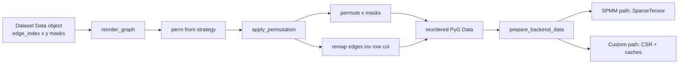

# PyG CSR SpMM benchmark: design & flow (LLM onboarding doc)

This document describes **`pyg.py`**: Graph Convolutional Network (GCN) forward passes, **node reordering**, **three custom CUDA CSR SpMM kernels**, and **how the benchmarking harness compares backends**. Intended for engineers or LLMs with no prior context on this repo.

**Primary source file:** `pyg.py` (paths below are approximate line anchors; drift is possible after edits.)

---

## 1. Problem being measured

### 1.1 What operation dominates here

For a fixed **2-layer GCN-style** network, each layer applies **sparse–dense matrix multiplication (SpMM)**:

```
X' = A_tilde @ X
```

- **A_tilde** — row-normalized adjacency **with self-loops** (from PyG **`gcn_norm`**; on GPU backends this becomes **CSR**: `row_ptr`, `col_idx`, `values`).
- **X** — node features, shape **`[num_nodes, feat_dim]`**.

Non-custom backends use **`GCNConv`** (PyG) or **`torch.sparse.mm`**. Custom backends replace only the SpMM multiply with handwritten CUDA kernels on that **CSR** triple.

### 1.2 End-to-end model shapes (conceptual)

- **Inputs:** node features **`data.x`**, graph structure (**`edge_index`** then normalized to sparse adjacency).
- **Outputs:** logits **`[num_nodes, num_classes]`** after two hop-like propagations and **Linear + ReLU** between them.

Two different “GCN wrappers” exist:

| Class | Sparse op | Dense ops |
|--------|-----------|-----------|
| `GCN` | `GCNConv` (uses `edge_index` or `SparseTensor`) | inside `GCNConv` |
| `CuSparseGCN` | `torch.sparse.mm(adj_csr, x)` ×2 | explicit `Linear` ×2 |
| `CustomSpMMGCN` | custom `*_spmm` ×2 | explicit `Linear` ×2 |

**Code:** `GCN` ≈ `pyg.py:472`; `CuSparseGCN` ≈ `490`; `CustomSpMMGCN` ≈ `508` (`forward` applies SpMM twice: `546–549`).

**Important:** The **custom kernels implement SpMM**, not general `GCNConv` fusion; linear layers stay in PyTorch.

---

## 2. Tensor / naming glossary

| Symbol | Meaning in this codebase |
|--------|--------------------------|
| `perm[i]` | **New** node ID for **original** vertex `i` (**gather** permutation on rows of `x`). Implemented as **`data.x = data.x[perm]`**. |
| `inv[old_id]` | **New** ID of vertex that was **`old_id`** before reorder; used to remap **`edge_index`**: `inv[row], inv[col]`. Built as `inv[perm] = arange(N)`. |
| `row_ptr`, `col_idx`, `values` | Standard **CSR** of **normalized** adjacency **A_tilde** (**after** reorder). |
| `degree` (reorder) | Undirected-ish count `bincount(row ∪ col)` for ordering strategies (`degree_desc`, …). Not the same as CSR row lengths used for **`custom_degree`** buckets (those come from **`row_ptr[1:]-row_ptr[:-1]`** after normalization). |
| **`custom_cache`** | Dict of tensors passed into `CustomSpMMGCN`: CSR parts + **`small_rows`** / **`medium_rows`** / **`large_rows`** + **`task_*`** for split_atomic. Built in **`prepare_backend_data`** ≈ `664`. |

---

## 3. Node reordering (outside all CUDA kernels)

Reordering changes **matrix / graph layout** only: same math on a **permuted** node set. **RCM / degree / random** etc. never run inside the SpMM kernels.

### 3.1 Pipeline



### 3.2 Strategies (`reorder_graph`, ≈ `608`)

| `order` | How `perm` is built |
|---------|---------------------|
| `none` | Identity `0..N-1`. |
| `degree_desc` / `degree_asc` | `argsort` of `bincount` of concatenated edge endpoints. |
| `reverse` | Reverse indices. |
| `random` | `torch.randperm`, seeded. |
| `rcm` | SciPy **`reverse_cuthill_mckee`** on **symmetrized** CSR in **NumPy/SciPy CPU** (`rcm_gather_perm`, ≈ `557`). Returns mapping converted to Torch on original device. **Can be expensive** on huge graphs. |

### 3.3 Applying the permutation (`apply_permutation`, ≈ `583`)

1. **`inv`** from **`perm`**.
2. **Row-wise reorder** of **`data.x`** (and **`y`**, masks if present).
3. **`edge_index`** replaces each endpoint `v` with **`inv[v]`**.

After this step, **all SpMM backends** (`spmm`, `cusparse`, `custom_*`) see the **same** logical graph; only packing differs.

---

## 4. Data preparation after reorder (`prepare_backend_data`, ≈ `664`)

For each **`order`** the script builds **two** prepared views from the **same** `reordered_data`:

| Backend key | Adjacency representation | Consumed by |
|-------------|-------------------------|-------------|
| `spmm` | `SparseTensor(row=col, col=row, …)` **`data.adj_t`** | PyG **`GCN` + SparseTensor**, benchmark tag `"spmm"`. |
| `cusparse` | COO **`gcn_norm`** → **`torch.sparse_coo_tensor` → sparse CSR** **`data.adj_csr`** | `CuSparseGCN`. |
| `custom_*` | Same **`gcn_norm`** CSR as **`adj_csr`**; **`csr_from_sparse_csr`** exposes `row_ptr`, `col_idx`, `values`; plus **`degree_buckets`**, **`build_row_split_tasks`** into **`data.custom_cache`** | `CustomSpMMGCN`. |

**Self-loops + normalization:** `gcn_norm(..., add_self_loops=True)` ensures the SpMM matches common GCN neighbor aggregation.

---

## 5. Three custom kernels (design rationale & launch pattern)

CUDA source lives **inside a string** in **`load_spmm_extension`** (~`115–386`): JIT-compiled via **`torch.utils.cpp_extension.load_inline`**.

They all compute **CSR SpMM**:  
`y[row, f] = sum_{e in nz(row)} values[e] * x[col_idx[e], f]`

### 5.1 `custom_simple` — `spmm_row_per_block_kernel`

- **Idea:** **One CUDA block ↔ one output row.** Threads in the block **stripe over feature dimension `f`**; inner loop scans **all** nonzeros of that row.
- **Pros:** Minimal code; easy correctness check vs `torch.sparse.mm`.
- **Cons:** **Load imbalance** on power-law graphs: low-degree rows waste the block; high-degree rows keep many threads busy in the inner edge loop while others idle on `f`-striping.

Launch: **`blocks = num_rows`**, `threads = 128` (~`255–269`).

### 5.2 `custom_degree` — `spmm_degree_aware_cuda`

**Idea:** Split rows into degree buckets (**by CSR nnz after norm**):

- **`degree_buckets`** (~`412`):  
  **small:** nnz ≤ 32  
  **medium:** (32, 256]  
  **large:** > 256  

**Kernels:**

| Bucket | CUDA entry | Parallelism sketch |
|--------|-------------|-------------------|
| small | **`spmm_small_kernel`** | One thread block processes many rows (thread-index picks row); sequential over `f` for simplicity. Good when rows are tiny. |
| medium / large | **`spmm_warp_per_row_kernel`** | **One warp ↔ one row**; lanes stripe `f`; inner loop over edges. Better for heavier rows than “whole block per row”. |

Runs up to **three sequential kernel launches** (skip empty buckets). **No atomics** between buckets (disjoint rows).

### 5.3 `custom_split_atomic` — `spmm_row_split_atomic_kernel`

**Idea:** For **every** nonempty row, **split edge list** into chunks of **`chunk_size` (default 256)** nnz using **`build_row_split_tasks`** (~`425`): produces **`task_row_id`**, **`task_start_edge`**, **`task_end_edge`**.

- Each **task** (chunk) mapped to warps similarly to **`spmm_warp_per_row_kernel`**.
- Partial sums **`atomicAdd`** into **`y[row, f]`** so **multiple chunks of the same row** combine.

**Trade-off:** parallelism **within** hub rows vs **atomic** contention on hot rows.

---

## 6. Model forward → kernel entry

`CustomSpMMGCN.forward` (~`545`):

1. **`_spmm(cache, x)`** — first propagation.
2. **`lin1`; ReLU.**
3. **`_spmm(cache, ·)`** — second propagation.
4. **`lin2`.**

`_spmm` dispatches (~`516–541`) to **`spmm_simple`** / **`spmm_degree_aware`** / **`spmm_row_split_atomic`** Python bindings bound to CUDA above.

---

## 7. Benchmarking harness (what is compared to what)

### 7.1 Main loop skeleton (`main`, ≈ `854`)

```
base_data ← dataset[0]
for each order in --orders:
    reordered_data ← reorder_graph(base_data copy, order)
    spmm_data[order] ← prepare_backend(..., "spmm")
    main_data[order] ← prepare_backend(..., backend_or_custom_simple_for_custom_all)
move all to CUDA
benchmark spmm_results[order]   ← ALWAYS: GCN + torch_sparse, every order
if custom_*:
    benchmark custom kernels on subset --kernel-compare-orders
    print speedup vs spmm **on the same order**
```

### 7.2 Two distinct measurements

| Block printed | Meaning |
|---------------|---------|
| **“Reordering benchmark (spmm …)”** | For **every** `--orders` value: time **same** **`spmm`** model on **`spmm_data[order]`**; reports **speedup vs `spmm@none`**. Measures **effect of permutation on library SpMM**. |
| **“Custom CUDA kernels vs spmm …”** | Only for **`--kernel-compare-orders`** (default **`none`**): for each listed order, timed **each** of **`custom_simple` / `custom_degree` / `custom_split_atomic`** (if **`--backend custom_all`**) vs **`spmm_results[order]`**. |

So: **Reordering sweep = SpMM-only across orders.** **Custom-vs-SpMM** = apples-to-apples on **chosen** orders, **same reordered CSR / features**.

### 7.3 Timing (`benchmark_forward`, ≈ `733`)

Warmup **`--warmup`**, then **`--timed-steps`** forwards; **`CUDA synchronize`** bracketing timers on GPU. Repeated **`--repeats`** outer loop for mean/std percentiles (`bench_stats`, ~`1007`).

### 7.4 Correctness

**`validate_spmm_correctness`** (~`817`) compares each custom variant’s output to **`torch.sparse.mm(data.adj_csr, x)`** on **`data`** for the chosen **`kernel_compare_orders[0]`** sample.

---

## 8. CLI quick reference

| Flag | Role |
|------|------|
| `--dataset` | `cora`, `reddit`, `amazon_photo`, `amazon_computers`, `ogbn_products`. |
| `--root` | Data root dir. |
| `--backend` | `spmm`, `cusparse`, `edge_index`, **`custom_simple`**, **`custom_degree`**, **`custom_split_atomic`**, **`custom_all`**. |
| `--orders` | List of reorder strategies **including `none`** (required for baseline reference). |
| `--kernel-compare-orders` | Subset of `--orders`; which orders additionally run **custom** timing vs SpMM (default **`none`**). |
| `--hidden` | Feature width for SpMM (affects arithmetic intensity). |
| `--warmup`, `--timed-steps`, `--repeats` | Timing stats. |

---

## 9. ASCII visualization: one row across strategies

CSR row `r` with edges `(r → c[e])`:

```
simple:        [ CUDA block_r ]–––– scans all edges of r ––––► writes y[r,*]

degree-aware:  row r routed to SMALL / MEDIUM / LARGE kernel bucket
               SMALL: many tiny rows/share blocks
               MED/LRG: warp_per_row ──► y[r,*]

split_atomic:  row r → chunks [e0..e255], [e256..e511], ...
               warp per chunk ──atomicAdd──► same y[r,*]
```

---

## 10. Dependencies & environment notes (for reproducibility)

- **`torch_sparse`**: required for **`spmm`** baseline / `SparseTensor` path (`pyg.py` imports ~`13–15`).
- **CUDA GPU**: required for **`custom_*`** / **`custom_all`**.
- **SciPy**: required for **`order=rcm`**.
- **OGB package**: **`ogbn_products`**.
- **PyTorch 2.6+**: `torch.load` default **`weights_only=True`** broke some OGB processed pickles; **`pyg.py`** may shim **`torch.load`** at top — keep in sync when sharing code.

---

## 11. File map (jump list)

| Concern | Location in `pyg.py` |
|--------|-----------------------|
| JIT CUDA extension | `load_spmm_extension` ~`36` |
| CSR extraction | `csr_from_sparse_csr` ~`402` |
| Degree buckets | `degree_buckets` ~`412` |
| Row-split tasks | `build_row_split_tasks` ~`425` |
| RCM permutation | `rcm_gather_perm` ~`557` |
| Reorder API | `reorder_graph` / `apply_permutation` ~`583–633` |
| Backend prep | `prepare_backend_data` ~`664` |
| Timing | `benchmark_forward` ~`733` |
| Custom GCN | `CustomSpMMGCN` ~`508` |
| CLI & loops | `main` ~`854` |

---

*End of document.*
