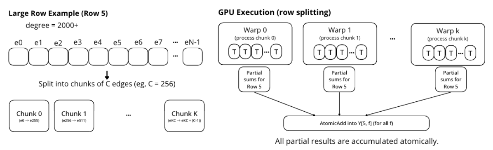

# Adaptive Warp-Centric Execution for Graph Neural Networks on GPUs

A degree-aware reordering framework for accelerating Sparse Matrix Multiplication (SpMM) in Graph Convolutional Networks (GCNs). Real-world graphs follow a power-law degree distribution, causing severe load imbalance across GPU warps during neighbor aggregation. Adapti addresses this by sorting nodes by degree and distributing them evenly across thread blocks as a one-time preprocessing step, with no changes to the graph's mathematical structure.

Evaluated on Reddit and ogbn-products, Adapti achieves up to **1.21x speedup** on the GCN forward pass with negligible preprocessing overhead.

## Quick start — run benchmarks

Entry point: **`pyg.py`**. On Hyak/Tillicum, use **`run_pyg_gpu.sh`** (sets CUDA paths via **`hyak_gpu_env.sh`**) or submit **`tillicum_pyg_job.slurm`**.

Copy the full repo to scrubbed (not only `pyg.py`):

```text
pyg.py  spmm_cuda.py  csr.py  reorder.py  models.py  data.py  benchmark2.py
run_pyg_gpu.sh  hyak_gpu_env.sh  tillicum_pyg_job.slurm
```

### Tillicum batch (recommended)

```bash
cd /gpfs/scrubbed/feier513
sbatch tillicum_pyg_job.slurm
```

Watch job and logs:

```bash
squeue -u $USER
tail -f pyg_<JOBID>.out
```

Default command inside `tillicum_pyg_job.slurm`:

```bash
bash run_pyg_gpu.sh --dataset reddit --backend custom_all \
  --orders none degree_desc rcm --kernel-compare-orders none,degree_desc,rcm \
  --hidden 64 --repeats 200 --warmup 50 --timed-steps 20
```

### Interactive GPU node (Hyak)

```bash
module load gcc/11.5.0 cuda/12.4.0 conda/Miniforge3-25.3.1-3
conda activate pyg-gpu
export PYG_WORKDIR=/gpfs/scrubbed/feier513
cd "$PYG_WORKDIR"

# Reordering + library SpMM vs three custom CUDA kernels
bash run_pyg_gpu.sh --dataset reddit --backend custom_all \
  --orders none degree_desc rcm --kernel-compare-orders none,degree_desc,rcm \
  --hidden 64 --repeats 200 --warmup 50 --timed-steps 20
```

### Other datasets

```bash
# OGB ogbn-products (pip install ogb; data under ./pyg_data)
bash run_pyg_gpu.sh --dataset ogbn_products --root ./pyg_data --backend custom_all \
  --orders none degree_desc rcm --kernel-compare-orders none,degree_desc,rcm \
  --hidden 64 --repeats 200 --warmup 50 --timed-steps 20

# Amazon co-purchase
bash run_pyg_gpu.sh --dataset amazon_photo --root ./pyg_data --backend custom_all \
  --orders none degree_desc --kernel-compare-orders none,degree_desc \
  --hidden 64 --repeats 200

bash run_pyg_gpu.sh --dataset amazon_computers --root ./pyg_data --backend custom_all \
  --orders none degree_desc --kernel-compare-orders none,degree_desc \
  --hidden 64 --repeats 200
```

### Direct Python (same as wrapper)

```bash
source hyak_gpu_env.sh
export PYTHONUNBUFFERED=1
python -u pyg.py --dataset reddit --backend custom_all \
  --orders none degree_desc --kernel-compare-orders none,degree_desc \
  --hidden 64 --repeats 200 --warmup 30 --timed-steps 100
```

### Quick smoke test

```bash
bash run_pyg_gpu.sh --dataset reddit --backend custom_all \
  --orders none degree_desc --kernel-compare-orders none,degree_desc \
  --hidden 64 --repeats 20 --warmup 5 --timed-steps 20
```

### Useful flags

| Flag | Meaning |
|------|---------|
| `--backend custom_all` | Run `custom_simple`, `custom_degree`, `custom_split_atomic` |
| `--backend spmm` | Library baseline only (torch_sparse) |
| `--orders` | Reorder strategies (`none`, `degree_desc`, `rcm`, …) |
| `--kernel-compare-orders` | Which orders get custom-kernel timing vs spmm |
| `--hidden` | GCN hidden width (64 matches common paper configs) |

**Note:** Reported ms timings are **forward-pass only** (after graph prep). Reorder + CSR build time is not included in those numbers. For `rcm`, install **scipy** in the conda env.

Design details: see **`KERNEL_DESIGN_AND_FLOW.md`**.

---

## How it works

GCN inference is bottlenecked by SpMM in the neighbor aggregation step. Under a naive row-parallel assignment, warps assigned to high-degree nodes do orders of magnitude more work than those assigned to low-degree nodes, stalling the kernel. Adapti reorders the input graph once before inference, grouping nodes into degree-sorted buckets that are evenly distributed across GPU thread blocks. This eliminates warp divergence and improves effective GPU utilization without modifying the SpMM kernel's math or the model weights.



---

## Environment setup

Tested on **NVIDIA H200**, **CUDA 12.4** (Tillicum), **Python 3.11**.

### Prerequisites

- [Miniconda](https://docs.conda.io/en/latest/miniconda.html) / Miniforge on Hyak
- CUDA-capable GPU (`nvidia-smi` shows CUDA 12.x)

### Local / generic conda

**1. Create and activate the environment**

```bash
conda create -n pyg-gpu python=3.11 -y
conda activate pyg-gpu
```

**2. Install PyTorch** (match your CUDA version)

```bash
pip install torch torchvision torchaudio --index-url https://download.pytorch.org/whl/cu121
```

**3. Install PyG and sparse kernels**

```bash
pip install torch_geometric
pip install torch_scatter torch_sparse torch_cluster \
  -f https://data.pyg.org/whl/torch-2.5.0+cu121.html
```

**4. Install OGB, SciPy, utilities**

```bash
pip install ogb scipy numpy
```

**5. Verify**

```bash
python -c "
import torch, torch_geometric
print('PyTorch :', torch.__version__)
print('PyG     :', torch_geometric.__version__)
print('CUDA    :', torch.cuda.is_available())
if torch.cuda.is_available():
    print('GPU     :', torch.cuda.get_device_name(0))
"
```

### Hyak / Tillicum (scrubbed)

Use conda env **`pyg-gpu`**, set caches under scrubbed if home quota is tight:

```bash
export SCRUBBED_USER_DIR=/gpfs/scrubbed/$USER
export CONDA_PKGS_DIRS=$SCRUBBED_USER_DIR/conda_pkgs
export TMPDIR=$SCRUBBED_USER_DIR/build_tmp
```

On compute nodes, **`run_pyg_gpu.sh`** sources **`hyak_gpu_env.sh`** (sets `CUDA_HOME`, `TORCH_EXTENSIONS_DIR` for JIT CUDA build).

---

## Running benchmarks (details)

### End-to-end GCN forward (`pyg.py`)

Measures full 2-layer GCN forward time (warmup + timed repeats). Two printed blocks:

1. **Reordering benchmark** — `torch_sparse` SpMM for every `--orders` value (speedup vs `none`).
2. **Custom CUDA vs spmm** — for each `--kernel-compare-orders` entry, times `custom_simple`, `custom_degree`, `custom_split_atomic` vs library SpMM on the **same** reordered graph.

### Script roles

| File | Purpose |
|------|---------|
| `tillicum_pyg_job.slurm` | Slurm job: modules, conda, then `run_pyg_gpu.sh …` |
| `run_pyg_gpu.sh` | GPU wrapper → `python -u pyg.py "$@"` |
| `hyak_gpu_env.sh` | CUDA / tmp / extension cache paths (not the benchmark itself) |

### Module layout

| File | Contents |
|------|----------|
| `pyg.py` | CLI and main benchmark loop |
| `reorder.py` | Node permutations (`none`, `degree_desc`, `rcm`, …) |
| `data.py` | Dataset load + backend prep (CSR, SparseTensor) |
| `spmm_cuda.py` | Custom CUDA SpMM kernels |
| `models.py` | GCN / CuSparse / CustomSpMM models |
| `benchmark2.py` | Timing, correctness checks, model factory |
